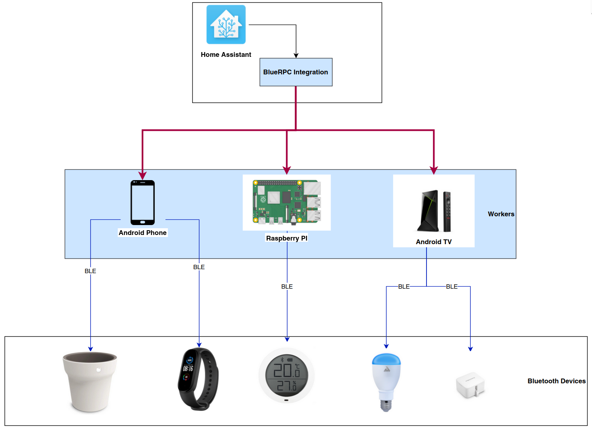

# BlueRPC

BlueRPC is a project that aims to be a simple way to communicate with multiple bluetooth devices in a large area using a proxy system.

See [Getting Started](1-getting-started.md) for setup instructions.

These proxies are available for Windows/Linux/MacOS with the [python worker](workers/python.md) and for Android/Android TV with the [android worker](workers/android.md).

The system can then be used to expand your bluetooth range: for example, you can install these workers around your house and use Home-Assistant to manage all your bluetooth IoT devices (similar to [esphome bluetooth proxies](https://esphome.github.io/bluetooth-proxies/)).

The data is transmitted over [gRPC](https://grpc.io/), a high-performance RPC famework made on top of HTTP/2 and using [protobuf](https://protobuf.dev/) as serialization mechanism. Encryption and authentication is supported using mTLS.

The following diagram sums up the project

